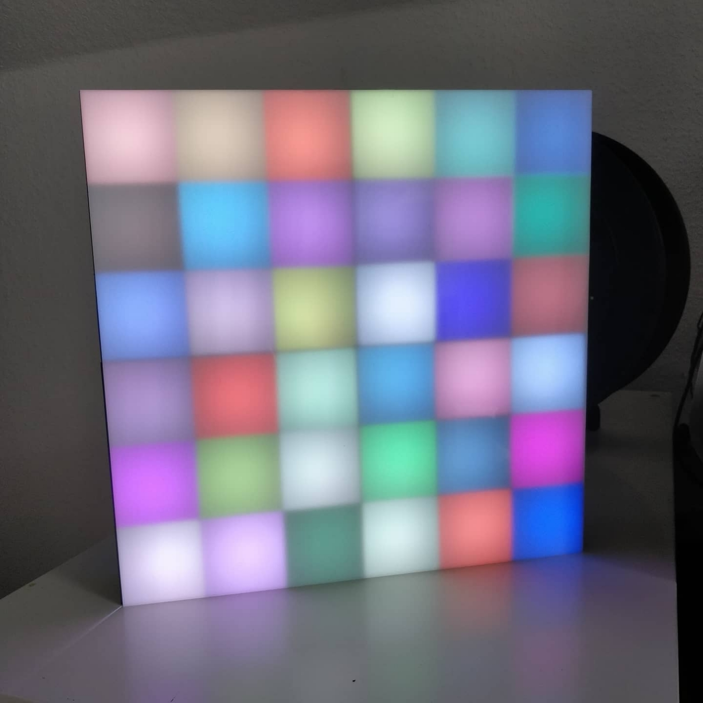

# micropython-ledmatrix



This is a 3D printable LED wall where you can plug in the commonly available
WS2811 LED strips and then controle the pixels remotly via UDP packets.

You have to flash [MicroPython](https://micropython.org/) on a ESP8266 board
(e.g. Wemos D1 or NodeMCU) and then copy the boot.py, main.py and your
modified config.py with your wifi credentials to the board.

On a Wemos D1 the DATA pin from the LEDs goes to pin **D2**.


## Material and building
The frame for the LEDs is 3D printed and the STL can be found on
[Thingiverse](https://www.thingiverse.com/thing:4458252). The file is a 3x3
frame (150x150mm to fit on a lot of printers) so you can scale the wall as
big as you like. The image above uses 4 of these frames glued together. Then
get yourself a strip of WS2811 LEDs and for a nicer apperance a 2mm sheet of
frosted acrylic/plexi.


## Client
To change the color of an pixel, just send a UDP package containing the index
of the pixel (starting from 0 just how they are wired on the strip) and the
RGB value in the following format: `i:r,g,b;`
To change multiple LEDs in a single paket you can just concatenate multiple of these strings together

A simple python client would look like this:
```python
import socket
from random import randrange

TARGET = "192.168.178.152"
PORT = 10080

i = randrange(0,36)
r = randrange(0,255)
g = randrange(0,255)
b = randrange(0,255)
msg = "{}:{},{},{};".format(i,r,g,b)

s = socket.socket(socket.AF_INET, socket.SOCK_DGRAM)
s.sendto(msg.encode(), (TARGET,PORT))
```
